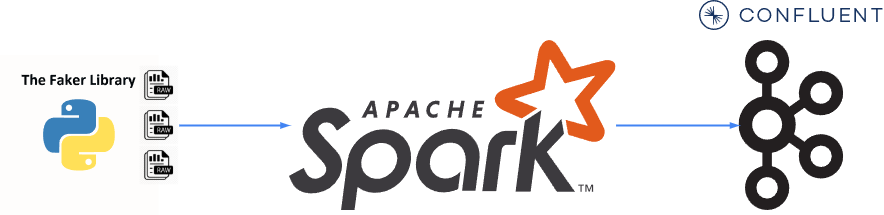
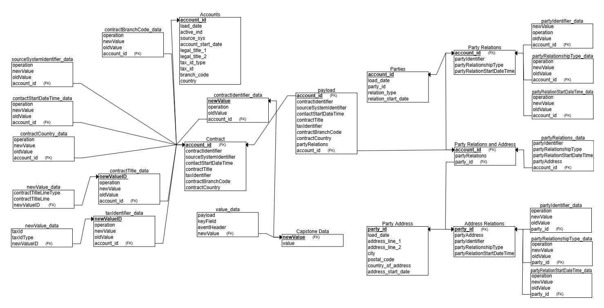
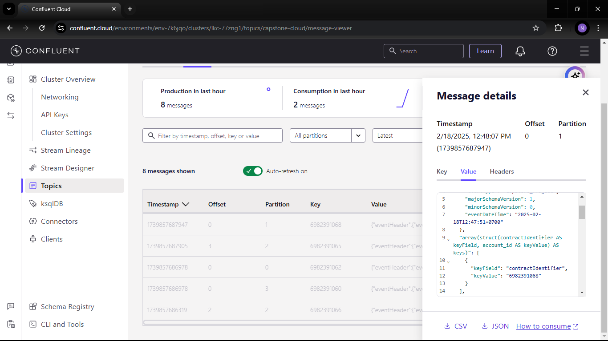

# Capstone Project

## Pengenalan
Capstone Project adalah proyek akhir dari kursus <i><b>Pengenalan Apache Spark berbasis Python</b></i> yang saya ikuti. Proyek ini menggunakan Hadoop untuk mendukung eksekusi klaster, serta menerapkan CI/CD menggunakan Jenkins untuk mempermudah proses update otomatis proyek. Proyek ini menggunakan Layanan Kafka dari Confluent Cloud yang diintegrasikan dengan Azure Services sebagai Penyimpanan Cloud, data yang telah diproses.

## Arsitektur Proyek
Arsitektur sistem yang digunakan dalam proyek ini ditunjukkan pada gambar berikut:

## Teknologi yang Digunakan
Project ini menggunakan beberapa teknologi utama:

| Teknologi       | Versi     | Fungsi              |
|-----------------|-----------|---------------------|
| Apache Spark    | 3.5.3     | Pemrosesan data skala besar|
| Hadoop          | 3.4.0     | Cluster eksekusi|
| Jenkins         | 2.492.1   | CI/CD pipeline|
| Confluent Kafka |           |Endpoint ETL|
|Pycharm|           |IDE yang dugunakan untuk mengembangkan program Spark	|
|Anaconda 3| conda 24.9.2 |Menyediakan Lingkungan Terisolasi untuk Pycharm|

## Library yang Digunakan
Berikut adalah library yang digunakan dalam proyek ini:

### Project Library
- `pyspark`: Untuk pemrosesan data di Spark.
- `faker`: Untuk menghasilkan data dummy.

### Testing Project
- `pytest`: Untuk pengujian unit.
- `chispa`: Untuk pengujian data di Spark DataFrame.
- `nutter`: Untuk pengujian notebook di Databricks.

## Data Model
Struktur data model yang digunakan dalam proyek ini ditunjukkan pada gambar berikut:

## Script for Project
Kode utama dari proyek ini dapat ditemukan di file berikut:
- [Main Script](main.py)

## Hasil Akhir

## Pengembangan Masa Depan
Di masa depan, proyek ini dapat ditingkatkan dengan:
- **Integrasi Apache Airflow** untuk orkestrasi workflow dan monitoring otomatis.
- **Fitur real-time streaming** menggunakan Apache Flink.
- **Visualisasi data** untuk analisis hasil pemrosesan data secara lebih interaktif.

## Penutup
Saya masih dalam tahap belajar dan terus mengembangkan keterampilan saya sebagai Data Engineer. Meskipun proyek yang saya kerjakan saat ini masih sederhana, saya melihatnya sebagai langkah awal untuk memahami dan menguasai berbagai teknologi serta konsep yang lebih kompleks di masa depan. Dengan terus belajar dan mengeksplorasi berbagai alat serta metode, saya berharap dapat memberikan kontribusi yang lebih besar dalam bidang data engineering.